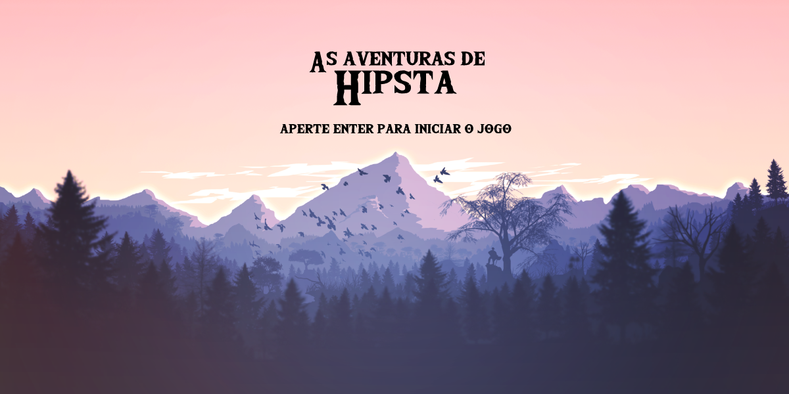

[![Contributors][contributors-shield]][contributors-url]
[![Stargazers][stars-shield]][stars-url]
[![LinkedIn][linkedin-shield]][linkedin-url]

# Imersão Gamedev - Endless Runner

Jogo desenvolvido durante a Imersão GameDev da [Alura](https://www.alura.com.br/)

<p style="text-align: center">
  
</p>

O projeto é feito utilizando a biblioteca [p5.js](https://p5js.org/). Essa biblioteca funciona com 2 funções principais: `setup()` e `draw()`

A função `setup()` executa uma vez antes do jogo começar, nessa função normalmente são iniciadas as variáveis e os assets são carregados.

Já a função `draw()` é o *game loop*, executa sempre, de acordo com o *frameRate*.

## Algumas Anotações

Tipos de background

```js
background(150) // escala de cinza
background(63, 224, 212) // r, g, b
background("#3fe0d4") // cor css, em hexadecimal ou rgb()

let imagem = loadImage('path/to/image')
background(imagem)
```

Tocar sons

```js
som = loadSound('path/to/sound')

som.play() // Toca uma vez
som.loop() // Toca em loop
```

## Créditos

Background por [DigitalMoons](https://digitalmoons.itch.io/parallax-forest-background)

[contributors-shield]: https://img.shields.io/github/contributors/guilhermebalog/imersao-gamedev.svg?style=flat-square
[contributors-url]: https://github.com/guilhermebalog/imersao-gamedev/graphs/contributors
[stars-shield]: https://img.shields.io/github/stars/guilhermebalog/imersao-gamedev.svg?style=flat-square
[stars-url]: https://github.com/guilhermebalog/imersao-gamedev/stargazers
[linkedin-shield]: https://img.shields.io/badge/-LinkedIn-black.svg?style=flat-square&logo=linkedin&colorB=555
[linkedin-url]: https://linkedin.com/in/guilherme-balog-gardino-233ab2186
